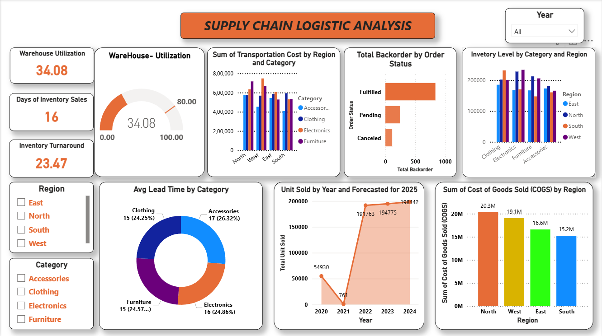

# 🚚 Supply Chain & Logistics Inventory Analysis

## 📌 Project Overview
This interactive Power BI dashboard provides a 360-degree view of Supply Chain operations. It analyzes warehouse efficiency, identifies bottlenecks in lead times, and forecasts future sales trends to optimize inventory management.

---

## 🖼️ Dashboard Preview

*Figure 1: Main Dashboard Interface showing KPI tiles and distribution charts.*

---

## 📊 Business Key Performance Indicators (KPIs)
* **Warehouse Utilization (34.08%):** Indicates current storage efficiency. Low utilization suggests space is available for scaling.
* **Inventory Turnaround (23.47):** High turnaround reflects efficient stock movement and strong sales.
* **Days of Inventory Sales (16 Days):** The average time taken to convert inventory into revenue.
* **Total Backorders:** Monitored to ensure customer satisfaction by reducing pending orders.

---

## 🛠️ Key Visuals & Insights
1. **Warehouse Utilization Gauge:** Real-time tracking of storage capacity.
2. **Avg Lead Time by Category:** Breaks down fulfillment speed (e.g., Accessories take ~17 days).
3. **Forecasting (2025):** Predictive analysis showing a steady rise in unit sales, reaching nearly **198K units**.
4. **COGS by Region:** Financial breakdown showing **North Region** as the highest cost center ($20.3M).

---

## 🔧 Technical Stack
* **Tool:** Power BI Desktop
* **Data Source:** CSV/Excel (SupplyChain_Dataset)
* **Data Transformation:** Power Query (ETL)
* **Modeling:** Star Schema / Relationship management
* **Language:** DAX (Data Analysis Expressions) for Calculated Measures

---

## 📂 Project Structure
* `Supply Chain logistic inventory.pbix`: Main Power BI file.
* `SupplyChain_Dataset.csv`: Raw data used for analysis.
* `Dashboard.png`: Visual preview of the report.

---

## 👤 Author
**Shashwat Pratap Singh** 

---
*Note: To interact with the dashboard, download the `.pbix` file and open it in Power BI Desktop.*
